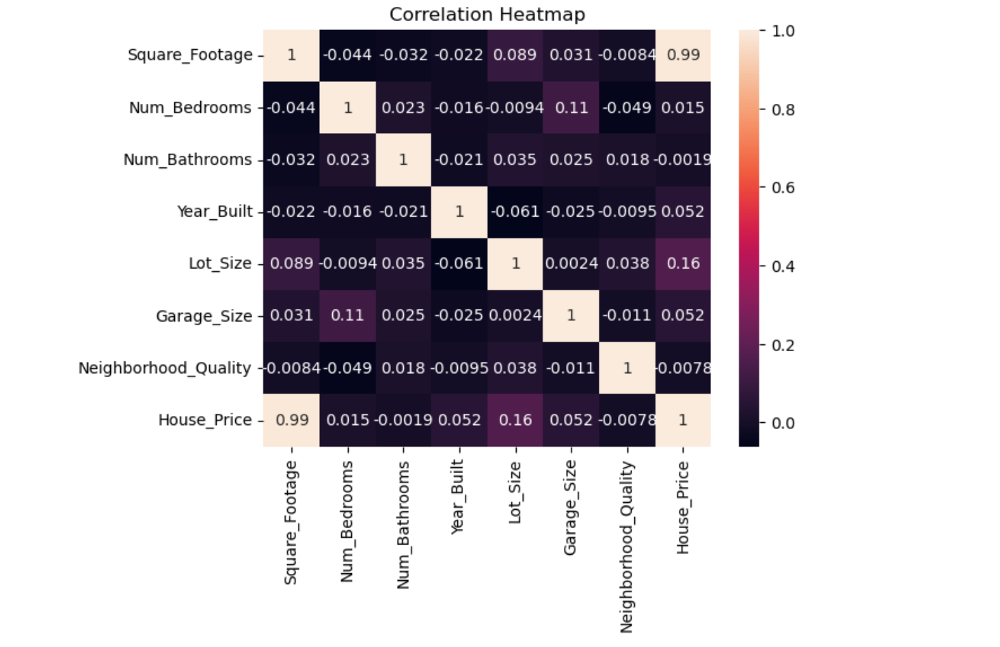
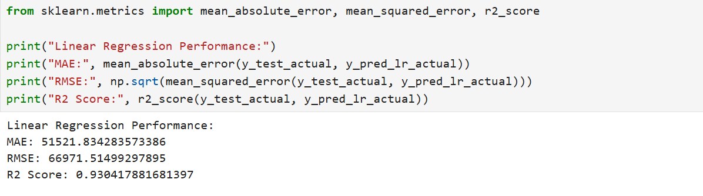

# 🏡 House Price Prediction using Machine Learning

## 📌 Problem Statement
Build a machine learning model to predict house prices based on features like square footage, bedrooms, bathrooms, and neighborhood quality.

## 🔍 Steps Performed
- Data Cleaning
- Handling Missing Values & Duplicates
- Exploratory Data Analysis (EDA)
- Outlier Detection
- Log Transformation
- Train-Test Split
- Feature Scaling

## 🤖 Models Used
- Linear Regression
- KNN Regression

## 📊 Evaluation Metrics
- MAE
- RMSE
- R² Score

## 📈 Results
- Linear Regression R² Score: **0.93**
- KNN R² Score: **0.89**

👉 Linear Regression performed better with higher accuracy and lower error.

## 🛠️ Tech Stack
- Python
- Pandas
- NumPy
- Matplotlib
- Seaborn
- Scikit-learn

## 📸 Project Screenshots

### 🔹 Correlation Heatmap

### 🔹 Model Results

